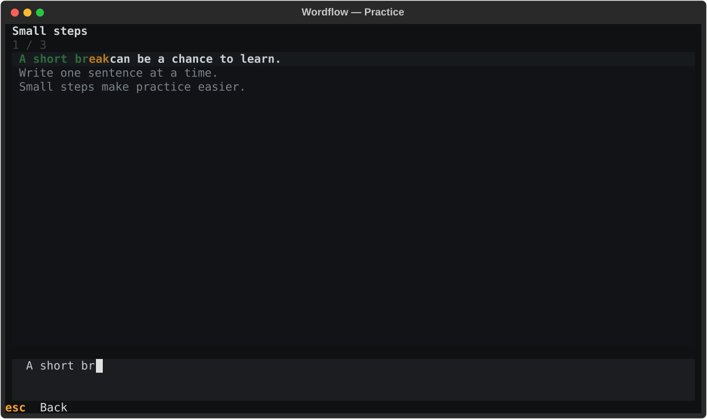
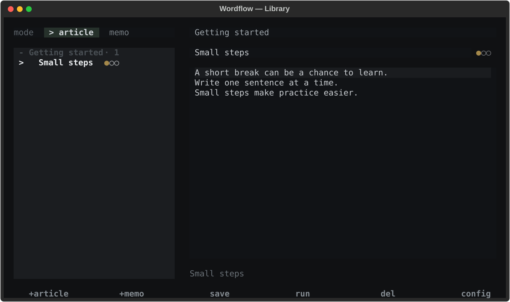

# Wordflow — English typing practice in your terminal

**Practice English spelling with your own text, one word at a time.**

Wordflow is a quiet, offline terminal app for short practice sessions during a work break. Paste a paragraph you want to learn, type along with the highlighted words, and repeat whenever you have a few minutes.

No account, browser, timers, or leaderboards. Your articles and progress stay on your computer.

[中文说明](README.zh-CN.md) · [Get started](#get-started) · [Report a bug](https://github.com/KaiXinChaoRen1/wordflow/issues/new?template=bug_report.md)



## Why Wordflow?

If you spend your day at a keyboard and want to get more comfortable typing English, Wordflow gives you a small place to practice alongside your usual tools. Bring sentences from your study notes, everyday writing, or an article you are reading.

- **Practice useful words.** Use your own text instead of a fixed word list.
- **Get feedback as you type.** Correct letters advance the highlight; a wrong letter shows a hint and lets you try again. Matching is case-insensitive.
- **Keep a quiet workspace.** A restrained terminal interface, keyboard shortcuts, and no sound.
- **Build a repeatable habit.** Finish a passage, see `Good`, then press `r` to repeat. Three completion dots track up to three finished runs per item.
- **Own your data.** Plain local JSON, with no account, cloud sync, or telemetry in the app.

This is guided copy-typing and spelling practice. The source text stays visible; there is no WPM scoring, pronunciation training, or vocabulary scheduling.

## Get started

You need **Python 3.9+**, Git, and a terminal. The commands below install this repository in an isolated virtual environment. An internet connection is needed to install dependencies; practice works offline afterward.

### macOS / Linux

```bash
git clone https://github.com/KaiXinChaoRen1/wordflow.git
cd wordflow
python3 -m venv .venv
source .venv/bin/activate
python -m pip install .
wordflow
```

### Windows (PowerShell)

```powershell
git clone https://github.com/KaiXinChaoRen1/wordflow.git
cd wordflow
py -3 -m venv .venv
.\.venv\Scripts\python.exe -m pip install .
.\.venv\Scripts\wordflow.exe
```

For later sessions, run `.venv/bin/wordflow` on macOS/Linux or `.\.venv\Scripts\wordflow.exe` on Windows from the repository folder. Windows does not require activating the environment or changing PowerShell's execution policy.

### Your first practice session

1. Choose `+article` or press `Ctrl+N`.
2. Enter a title and paste a short English passage into the body. A group is optional.
3. Save with `Ctrl+S`, then start with `Ctrl+R`.
4. Type the highlighted word. Word spacing is handled automatically; type apostrophes and hyphens when they appear inside a word.
5. When you see `Good`, press `r` to repeat or any other key to return. Press `Esc` during practice to leave without marking the run complete.

Try this original sample:

> A short break can be a chance to learn. Write one sentence at a time. Small steps make practice easier.

The library starts empty. You can also try [two sample passages](examples/articles.json) in a separate data file using the instructions below.

## Your library



Use **article** for passages split at sentence punctuation and line breaks, or **memo** for notes practiced one non-empty line at a time. Article splitting is a simple punctuation rule, so abbreviations may need manual adjustment.

Articles can be grouped into collapsible sections. Use the arrow keys to preview an item and `Enter` to practice it; on a group heading, `Enter` expands or collapses the group. Clicking an article starts practice too. Long titles can be viewed with the horizontal scrollbar. The preview shows completion dots and follows the same sentence breaks as practice.

| Shortcut | Action in the library |
| --- | --- |
| `Ctrl+N` | New article |
| `Ctrl+S` | Save the editor |
| `Ctrl+R` | Practice the selected saved item |
| `Ctrl+D` twice | Delete the selected item |
| `Ctrl+T` | Switch between article and memo |

Save edits before switching items or starting practice. The app does not autosave. Practice currently recognizes English letters (`A–Z`), including words with apostrophes and hyphens; numbers and other punctuation are not typing targets.

## Local data and sample content

The default data file is `~/.wordflow/articles.json` (`~` means your home folder). The `config` button shows the actual path. Existing installations may use the legacy `~/.spelllane/articles.json` path.

To try the included samples without replacing your library, run from the repository folder:

```bash
WORDFLOW_DATA_PATH=examples/articles.json .venv/bin/wordflow
```

On Windows PowerShell:

```powershell
$env:WORDFLOW_DATA_PATH = "examples/articles.json"
.\.venv\Scripts\wordflow.exe
Remove-Item Env:WORDFLOW_DATA_PATH
```

Practice updates the selected JSON file, including the sample file's completion counts. To import your own records or make a backup, close Wordflow first and copy or edit the file shown in `config`. Back up your existing file before replacing it. There is no merge/import wizard.

See [the data format](docs/data-format.md) for fields and custom sentence breaks.

## Development and standalone builds

```bash
python -m pip install -e ".[dev]"
pytest -q
PYTHONPATH=src python3 -m compileall -q src tests
```

On macOS/Linux, `./run-dev.sh` runs the source with the active Python environment. See [CONTRIBUTING.md](CONTRIBUTING.md) for the project scope and how to report reproducible bugs, and [build instructions](docs/building.md) for Windows and Linux standalone executables.

The maintainer develops on macOS. Windows and Linux build scripts are included; they need to be built and checked on their target systems.

## Help make Wordflow useful

If Wordflow fits your routine, a star helps you bookmark it and shows interest in the project. Reports about confusing steps, terminal problems, and real practice needs are especially useful. [Open an issue](https://github.com/KaiXinChaoRen1/wordflow/issues) in English or Chinese, or send a small, focused pull request.

## License

[MIT](LICENSE). Built with [Textual](https://github.com/Textualize/textual).
